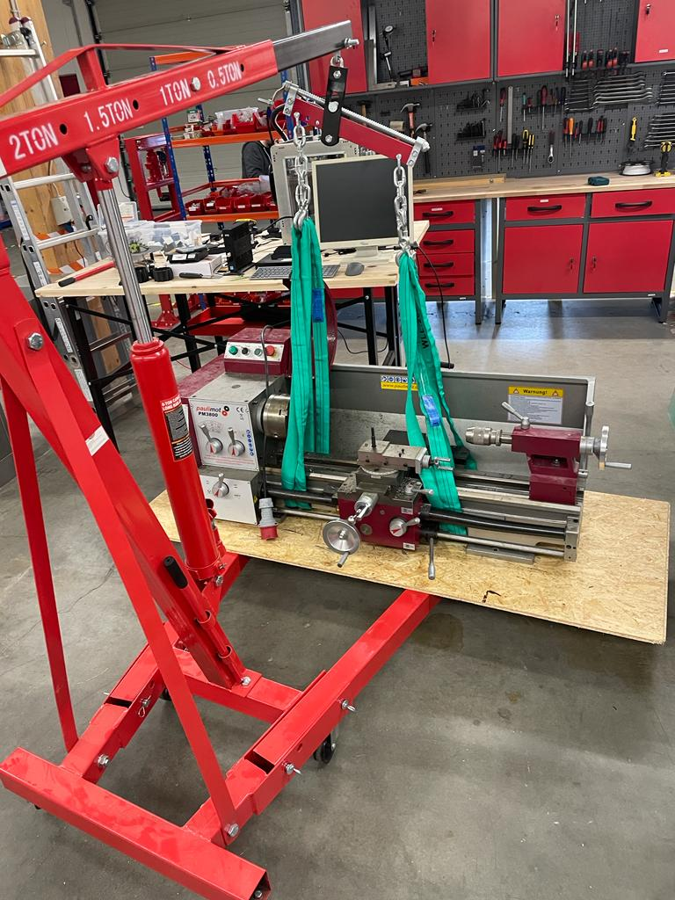
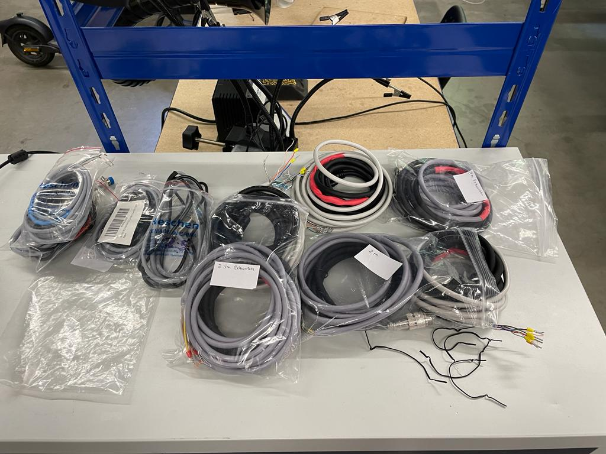
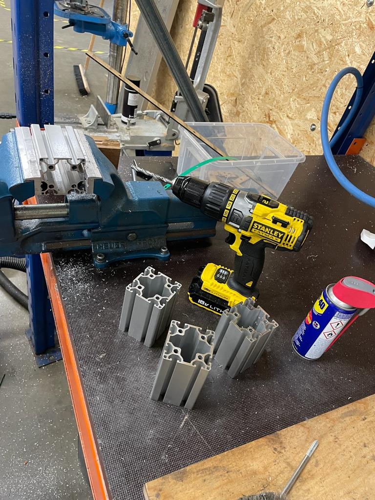
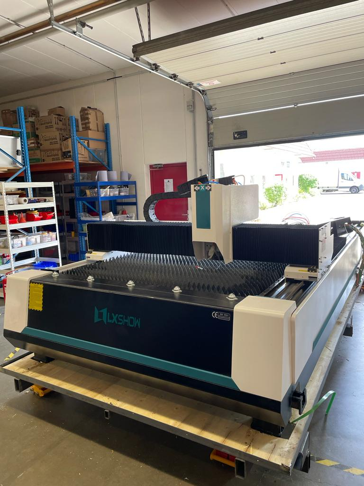
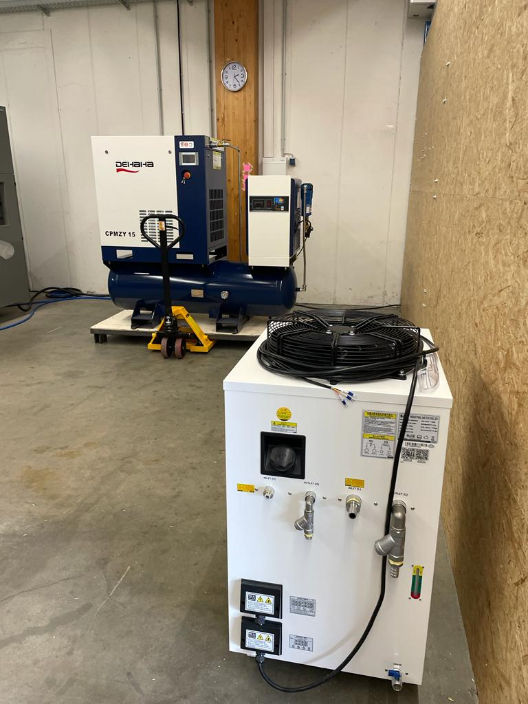

# WEEK 11

## Lathe Machine Disassembly

This week commenced with laser cutting an MDF profile on Laser DUO which was intended to help in drilling holes on the bottom of the lathe machine. Since the bolts attached to the ground were very long, we were unsuccessful in detaching it from the machine. Hence it was important that we drilled holes to remove the bolts. We first started drilled holes with an M5 drill bit and kept inreasing the bit size graduallu till M16. After this we used a step drill in order to drill larger holes quickly. We used wrenches to losen the bolt as the drill machines were unable to remove the bolts from the ground. After a certain lever of unscrewed, we used a small handsaw to cut the bolts. At the end of this process, the lathe machine was sucessfully disassembled from the ground.

## Antenna System

### Motor Cables Extension

We were given another task related to soldering. Our aim at the end was to extend the power cables for stepper motor lengths of 1.5 and 2 metres respectively and encoder/data cables to lengths of 1.5 and 2 metres. These motors are a part of an antenna system that is being developed at the company for a customer.

Following this, we also soldered 2, 2.5 and 3.5 metres cable extensions for inductive probes which also part of the system.

### Drilling

We were provided four aluminum profiles that needed enlarged holes throughout. Using the hand drill, we increased the diameter of all the holes.

## Research

A followup of the previous week's research on controllers was continued. Upon recieveing some feedback, we added more information about controllers which would prove to be essential while shortlisting the controllers.
We also included some more controllers such as raspberry pi to our list of controllers.

## New Fibre Laser Machine

We received a new fibre laser cutter that was shipped from China. We aided in the unboxing of this machine. It came in a container, so once it was dropped, we unscrewed the box which was on the outside of many parts and checked if the machine was in a proper condition. With the help of a Palette Jack, we lifted and moved the compressor of the machine.

