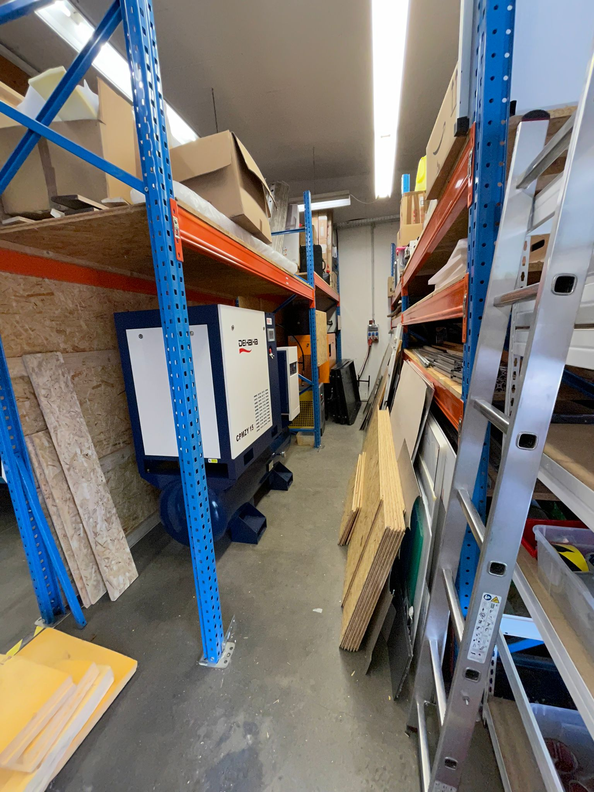
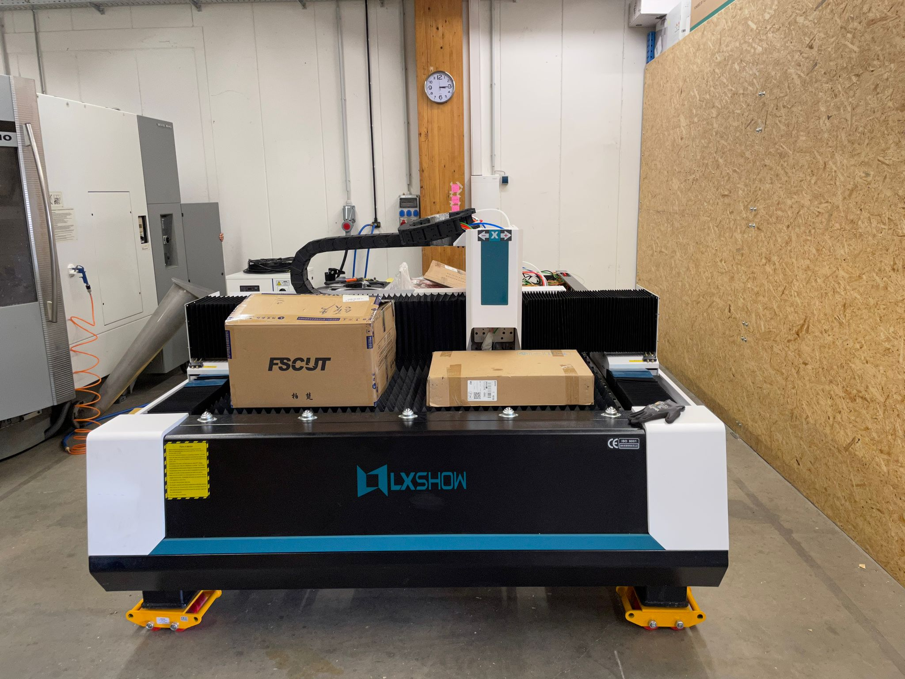
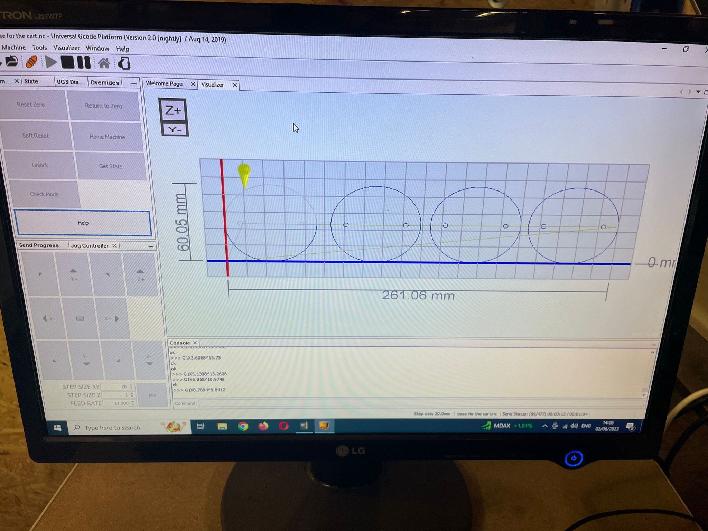
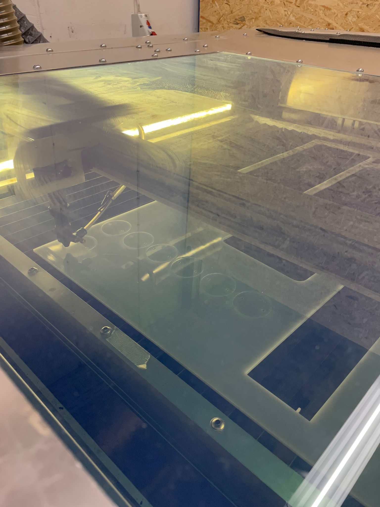
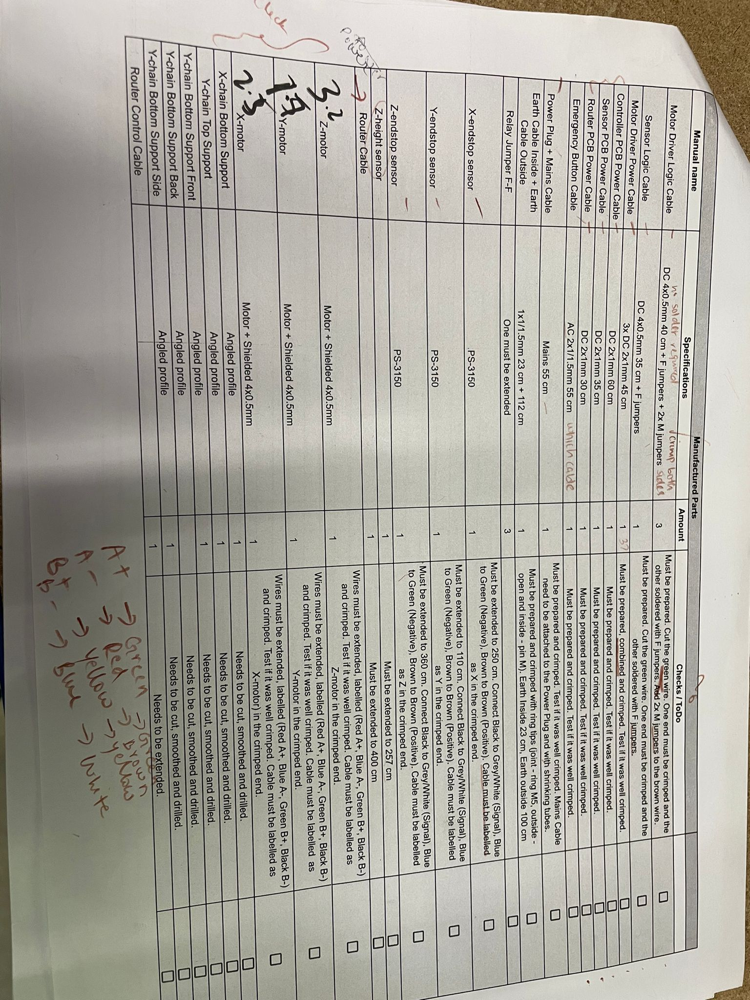
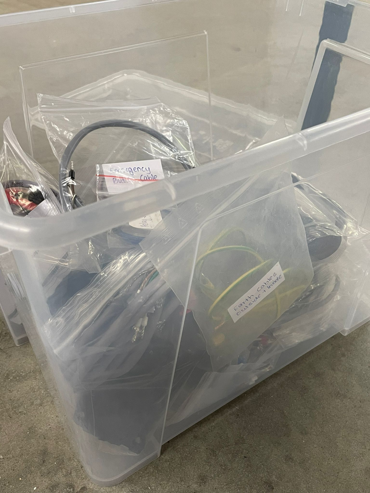

# WEEK 12

## Fibre Laser Installation

This week was mostly focused on installing the fibre laser and its components. 

In order to make space for the compressor of the machine, a part of the inventory where aluminum and wooden planks were stored, was cleared. This was done so that the compressor could fit in this place. Later on a mobile storage would be assembled to store the removed materials.

After placing the compressor, I along with the entire team were helping out in carefully moving the fibre laser to the desired position. This was achieved with the help of floor jacks and pallet jack. This task was relatively time consuming as it was important not to damage the machine while moving it. 

Once the machine was in place, I organized all the cables into the cable chain and labelled them.

Upon checking, it came to our notice that the trays on which laser cut pieces would  be collected, was not fitting under the machine. So, I removed the wheels from the tray in order to reduce the height and to ensure smooth and frictionless movement, I laser cut 5 acrylic pieces and fixed them under the tray.

This proved to be successful and the issue was solved.

## CNC Milling Machine

For the workshop taking place this month, I was preparing the wirings and cables required for the cnc machine. To do so, a table with details of the cables and the electrical components. 

Following this table, the approprite cables were collected and then crimped, while some were soldered as well to ensure secure connections. The connections were then checked with those of the existing machine in the lab.

Following this, all the necessary electric components such as motors, motor drivers, sensors were organized properly for the assembly of the machine.

## Reflection

 These hands-on experiences allow me to gain practical knowledge about different components, their interconnections, and troubleshooting methods. Additionally, preparing cables and ensuring secure connections teach me about the right connections to make and increase my electrical knowledge . These tasks also teach me the importance of attention to detail, precision, and problem-solving. It contributes to my overall understanding of industrial processes and enhance my engineering expertise.

