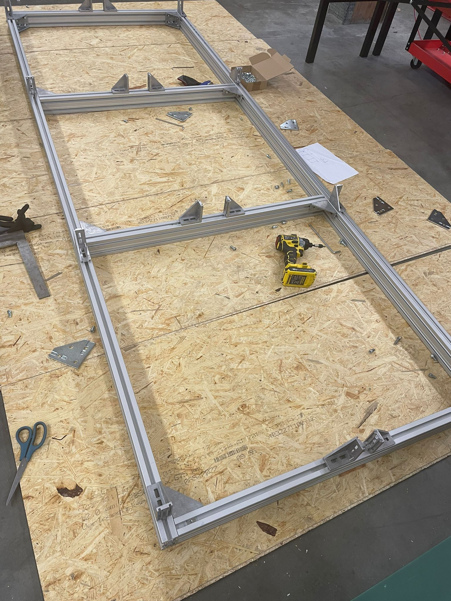

# Week 13

## New Mobile Storage

A new mobile storage was to be assembled for housing plates of various materials. First, we were provided with all the necessary materials like aluminum profiles, fastners etc. Upon having a discussion with Daniele, a layout for the assembly was finalised with the goal of having a strong structure. Following this, I started with assembling the profiles and and joined them using Tnuts and bolts. Wheels were also added to the base to to make it mobile.

Once this was ready, all the plates were loaded onto it and segregated according to material.

## Fibre Laser 

Continuing towards the installation process for the laser cutter, I organized the cables of the machine inside the cable chain. There was some wires that were exposed which had to be covered for safety reasons. This was achieved by designing and laser cutting an acrylic plate using Fusion 360, Visicut ang UGS. I first measured the dimensions for the plate using Vernier Calipers and the measuring tape, which was followed by designing.
It took us 2 prototypes to be successful as the first time, the holes were not alinging and the width of the plate was less.

##  Controller Project

A meeting was held this week regarding the selection of the controller and the goals that is to be achieved. The microcontroller from raspberry pi was finalized, RP2040. 

To begin with, I started with researching about this controller and looking into the data sheets. We were provided with 3 options from RP2040 namely, Pico, Pico and zero and had to evaluate all these controllers. Pico and pico w were mostly the same with all pinouts exposed but Pico w having an extra feature of Wifi. RP2040 zero was a compact microcontroller with not all pinouts exposed. 

Upon researching, we decided to program these controllers using Arduino IDE. Simple program were flashed to check their proper functioning.

After this,our goal was to connect the RP2040 to a teensy4.1 controller using a serial connection. The RP2040 would act as a primary controller and Teensy acting as the secondary. 

I soldered the teensy4.1 with pin headers to eshablish bread board connections between the two controllers.

## Reflection

 These hands-on experiences develop practical skills, from organizing cables and ensuring safety with laser-cut acrylic plates to showcasing knowledge of material selection and structural integrity. I was able to learn first-hand about brainstorming and problem solving while not wasting much material and other resources.  The controller project enhances research and evaluation. I have gained alot of knowledge on the selection process of controllers.In particular I have learnt alot about the Teensy 4.1 and Rp2040 Pico W. 