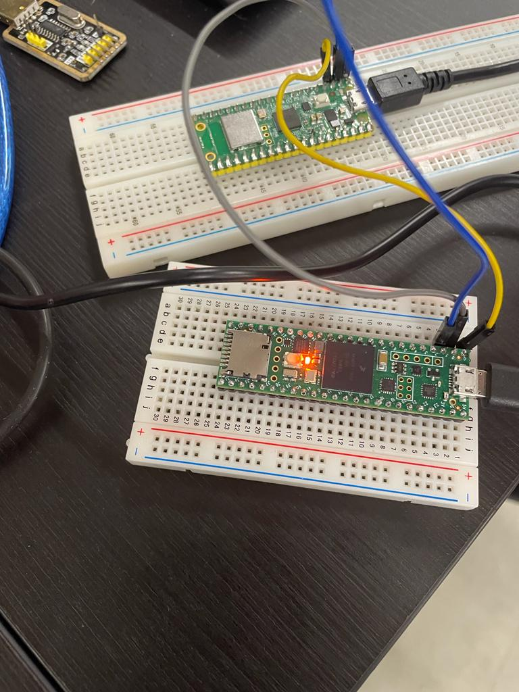
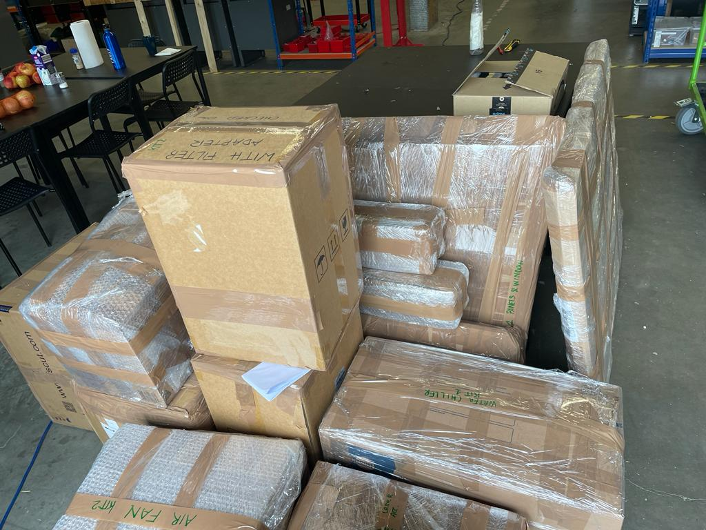
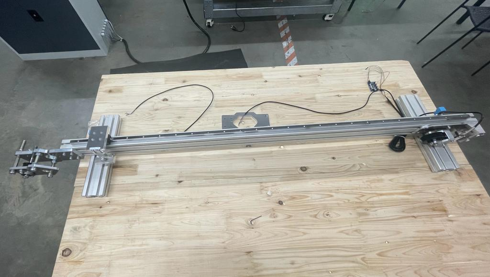

# Week 14

## Controllers Project

 There was a lot of advancement in the controllers project this week. 

 ### Teensy Firmware

 The first step to use program the teensy was to install its library in Arduino. In order to establish communication in the Teensy,I installed the firmware used by the company for all the machines and read about it. The purpose of using this firmware is to understand the commands from the G-code file and execute them.
 
After analyizing, we concluded that the GRBL file in the firmware which took care of the motion control blocked all the UART ports. Hence only the USB port could be used for serial communication. In this way, it would not be possible to communicate between the RP2040 pico w and the teensy. So it was necessary to read through the entire file of the firmware and edit it such that the UART ports could be enabled. This proved to be challenging as the file was large and difficult to understand.

### Establishing Communication

 After this modification, I tested if the teensy and pico could communicate via the UART ports. To do so, I first made the connections between the two controllers and then flashed an example program on arduino using Rp2040 pico as the selected board. 

 The program was coded such that if data available at the UART pinouts of Pico (which was connected to teensy). So, on sending "$$" (according to the firmware) via the serial monitor on Arduino, the information on motion control could be recieved and edited if necessary..

 I also tried to program the teensy using a USB to serial converter, in case the port was not enabled for UART communication, but it was not required.

 

 ## Packaging of OLSK Kits

Open-Lab starter kits(OLSK) of a laser cutting machine was to be shipped to Tunisia for a workshop. For this, I helped my fellow colleague in the packaging of the machine parts and verifying with the BOM of the machine to ensure everything was packed, to be able to ship them. Since most of the material was aluminum, it was important to pack them without getting scratched or damaged. Two such kits were to be packed for shipment.

## Assembly of Testing Rig

For a new verison of a 3D printer being developed at the company, a testing rig had to be assembled in order to test the range of the stepper motor. I checked the 3D model of the rig on Fusion 360 to make the assembly.

Further, I also checked for the components required in the inventory and created an order list for the components which had to be ordered. 

## Reflection

This week, I could successfully use and develop my skills to read and interpret technical drawings and 3D models in order to understand and make the assembly of the testing rig. Due to the prior experience I recieved at the university on the C language, I was also able to pick up programming on Arduino IDE. These skills that I am getting to enhance  added advanatage for my future career prospects.

