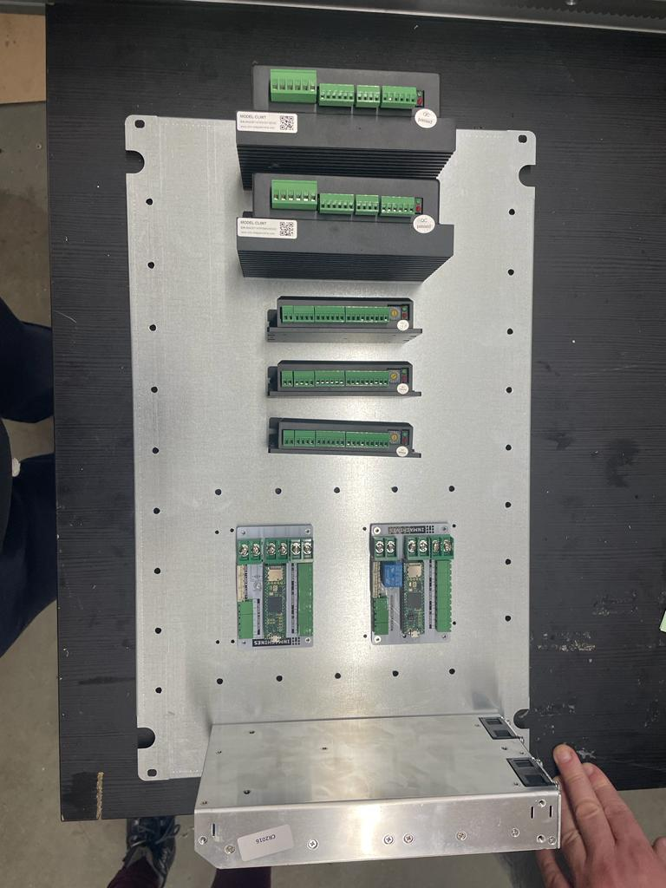
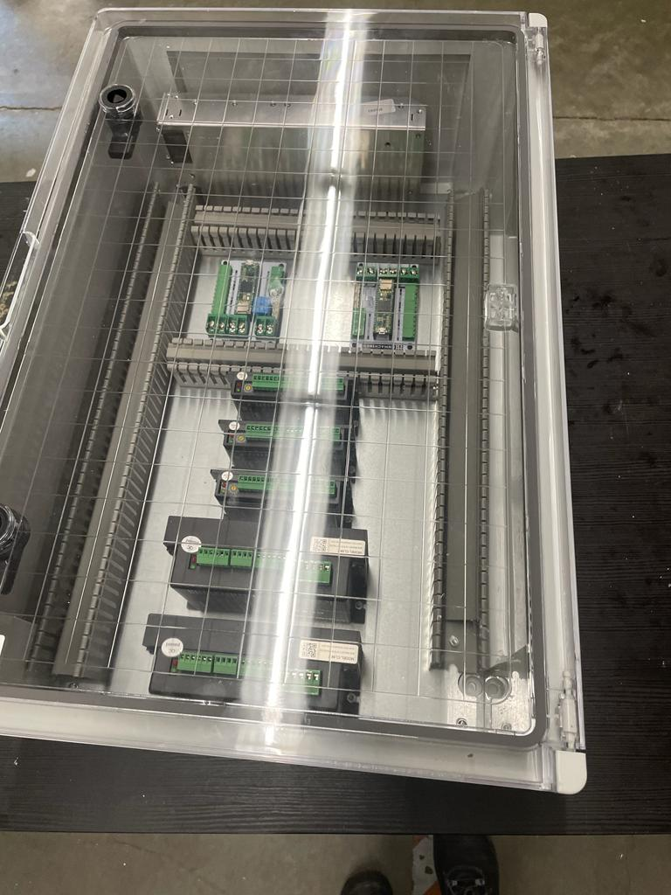
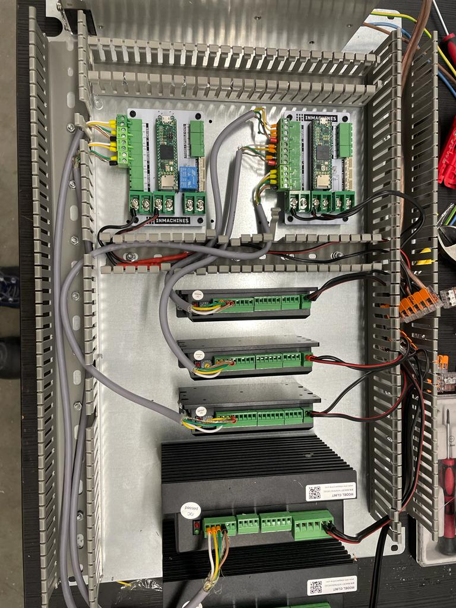
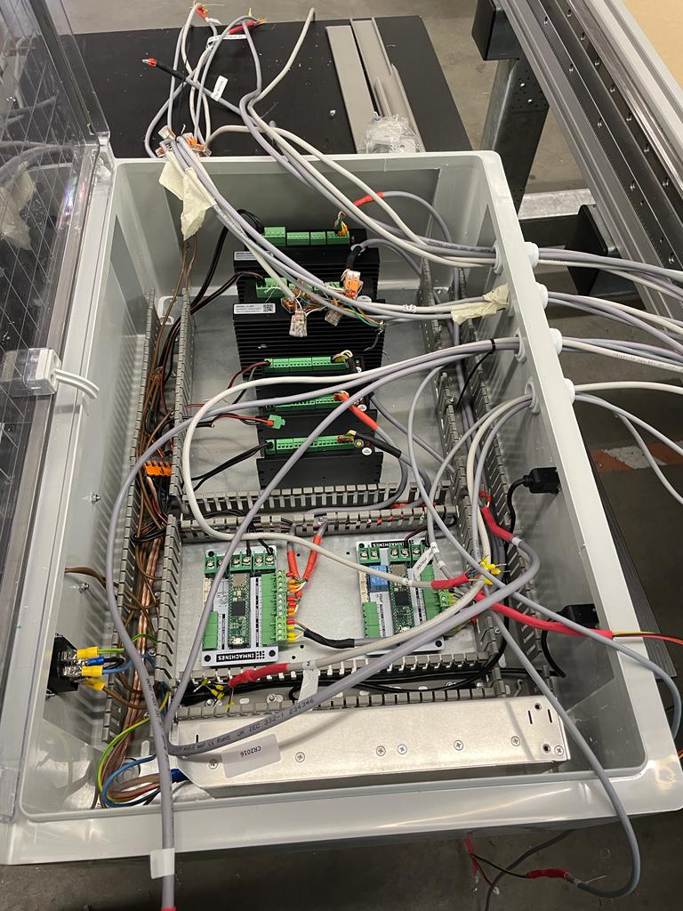
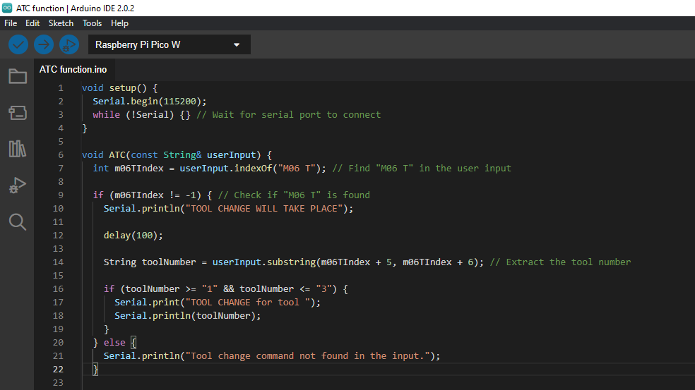

# Week 15

## Antenna System

For the Antenna system that is being developed, the electric box containing all the electrical and electronics components like the motor drivers, pcbs and wirings had to be installed. As a first step, on an aluminum plate, I placed the motor drivers, the dc power supply and fixed them using screws. 

Then, I cut cable channels to specific lengths using the bandsaw and fixed them to the plate as well using fastners.

On the outer of the electronics box, the main switch and emergency stop button were places.
Then the base plate was put inside the electronics box.

The connections between motor drivers, pcbs and power supply were made. Following this, I had to extend the cables of  2 inductive probes for which I soldered the probes with a 3 core wire respectively. Several wires for the motors, drivers etc. had to crimped as well.

Further, several cables were also extended using connectors and soldering to increase their lengths in order to reach the electronic box conveniently.

Once all this was done and verified, the next phase was making the connections. The first connection that was made was a serial connection between the power supply, mains switch and a normally closed emergency stop button such that power is supplied only when both the switch and button are closed. 

The cable glands had to be fixed to the box so that the wirings from the system could enter the box. For this four M25 holes were drilled on the box and then the cable glands were fixed.

All the wirings from the system were then brought into the box and organized. 

## Programming on Arduino

This week, I was programming the rp2040 alone and learnt about new functions. To develop the code for tool change it is important to know about the regex library and its functions to implement them in the program. Since I had no prior knowledge in this, I took sometime to learn about it and understand how to implement it.

Alternatively,I also made an example code using the indexOf() function in Arduino. The outcome of the code was to search for "M06 T1" or "M06 T2" or "M06 T3" from the user input on the serial monitor and if this string was found, the monitor would display a message. In the g-code, M06 is the command that prompts for tool change which is why I used M06 in the string.

Further, I tried optimising the code by creating a function that searches for the string from the user input and displays a message.

## Reflection

I was able to enhance my understanding about electrical and electronics components and how to make electrical connections through the hands-on experiences while working on the Antenna system which is highly relevant to my engineering degree.

 Learning about functions like the regex library and implementing them in the code for tool change functionality provided me with a deeper understanding of programming concepts. Additionally, creating an example code using the indexOf() function to search for specific strings in the user input showcased my problem-solving abilities.

