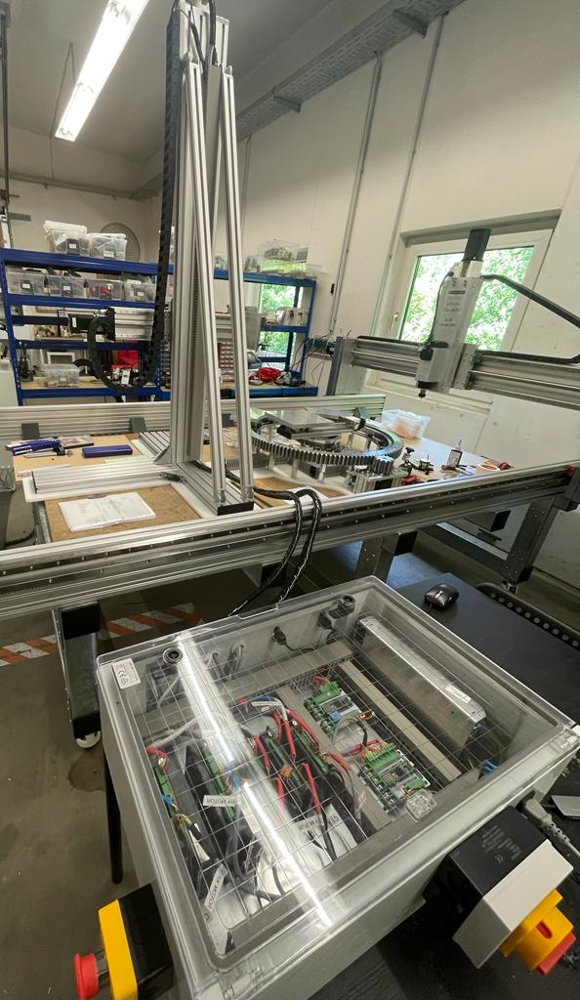

# Week 16

## Electronics of Antenna System

The antenna system is set to be delivered next week, so I was almost completly assigned to complete the electric connections of the machine in order to test and verify the functioning of it.

I first started with looking into the data sheet of the stepper motor used to determine the pairings of coils. The motor wires were extended by soldering a 4-core cable. 

The connections for all the motors, drivers and inductive probes were extended through soldering. I also added the crimping connectors to the wires. Once these cables were prepared, the next step was connecting all these electronic components. The motor data and encoder cables were connected to the motor drivers into the correct pinouts with the help of the data sheet of the driver.

## Motor Testing

Since all the connections for the system was now complete, the motor testing was necessary to determine if the desired output is obtained. For this, I flashed the GRBL firmware on the microcontroller on Arduino IDE and connected the PCB to the laptop. With Daniele, using the UGS software the motor testing was done. But, 3 out of 5 motors did not move. 

To find the issue, I first re-checked all the connections that were made and there was no problem. So next, using the multimeter I checked for electric resistance/noise and it was determined that since the cables were too long, there was alot of electric noise due to which the motors did not work. I had also used cables of very small diameter due to which the effect was more prominent.

The solution was to replace the extensions with shorter and thicker cables.

Once again after the extensions were solder, the testing of motors began. This time, the motor worked but only in open loop, there was some problem with the encoder cable due to which closed loop was not functioning. I looked into the data sheet manual and online to confirm if the connections were correct. After alot of brainstorming, the problem was identified. The data sheet had a printing error due to which we made the wrong connections!
 
 After rectifying the connections, the stepper motors working as desired.

## Laser cutting

Later,I was given the task of laser cutting a HDPE profile which is a thermoplastic polymer known for its tensile strong properties. Since the material is also flammable, I was working under the supervision of my colleague. 

## Reflection

This week I learned the process of how to think my way out when a problem arises. With electronics especially, it is not necessary that things will function ideally even if all connections seem correct. This experience would be really helpful for me in the future to know how to deal with such issues.

Further, it was a good experience to cut a new material. I used the experience I had gained so far to determine the suitable settings to cut the profile.
