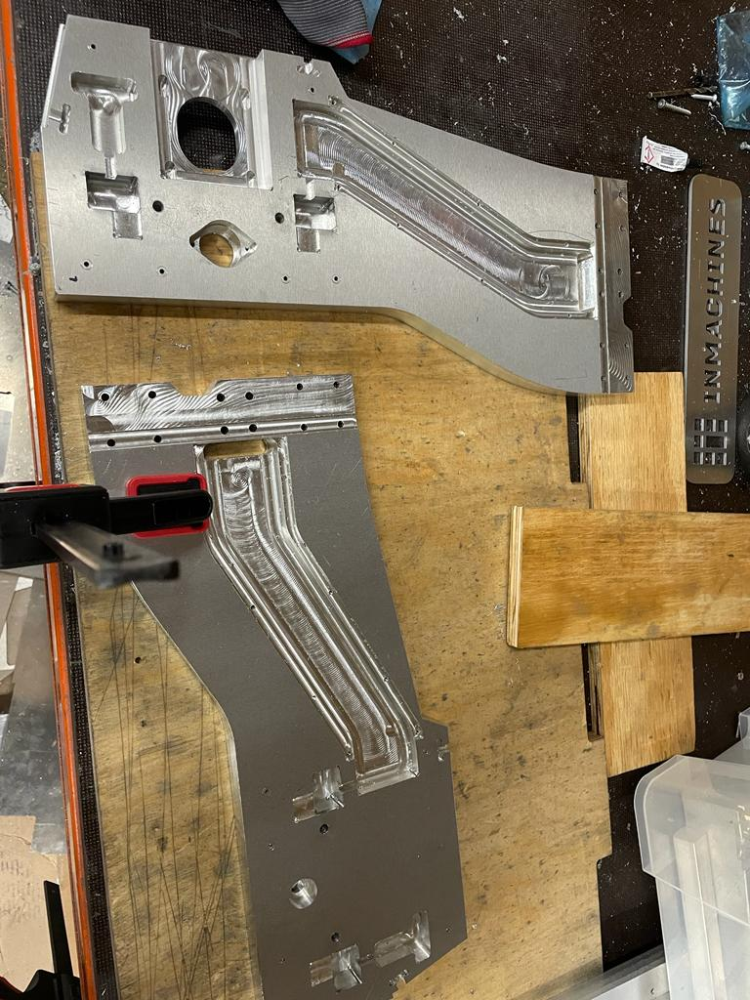
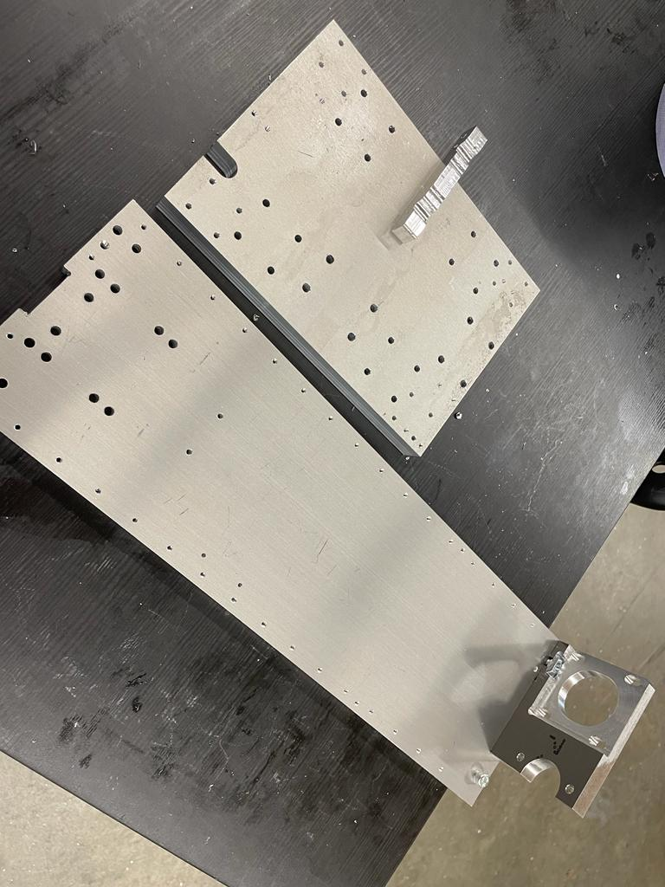
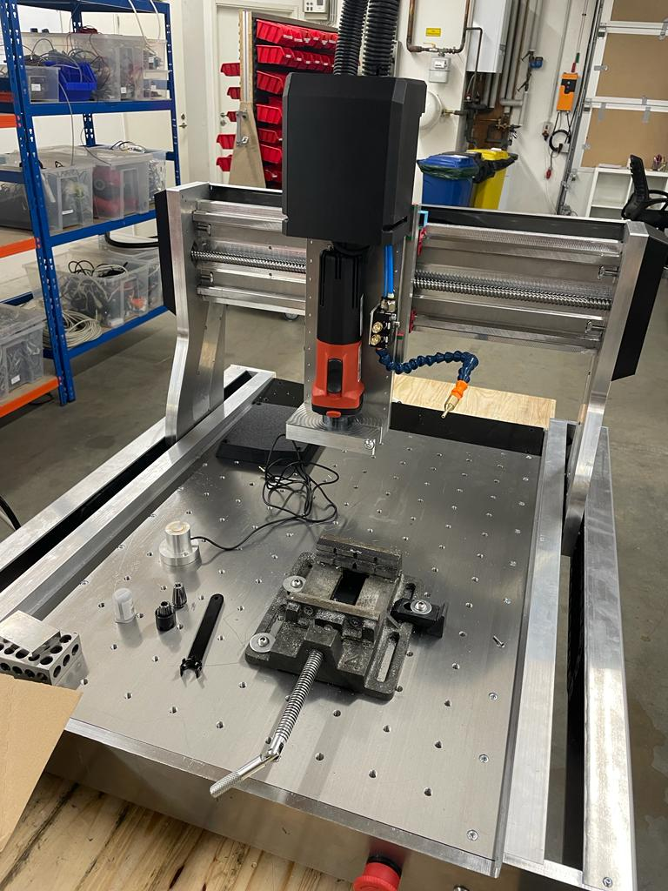

# Week 17

## Production of small CNC milling machine

This week commenced with the production of the second version of a CNC milling machine which was designed by my colleague. To increase the efficiency of the production process, I cut some aluminum L-brackets to the required lengths, drilled and tapped holes on them. For drilling, I was provided with the CAD file of the design from which I created the dxf file for laser cutting the masks of the holes that were to be drilled.

There were many profiles that were milled freshly. These profiles were deburred to remove sharp corners and once again needed many holes to be drilled. I read the CAD files to determined the dimensions of the holes and generated the dxf files for laser cutting the masks. After placing the masks on the face on the piece, first the guide holes were drilled following by the required diameter. After series of drilling process, most of the holes were tapped as well.

Drilling and tapping took a few days to complete for all the housing components of the small CNC.

These are some of the profiles on which I worked:

## Assembly Process

The next phase was the assembly of the produced parts.

For the assembly, ofcourse it started with the base of the machine. All the hole alignments and tappings were double-checked to ensure nothing was left out. After the inspection, the assembly began.  After the base was assembled, I along with 2 other colleagues inserted pulleys and bearings in the aluminum profiles. This proved to be a challenging task as the bearings were supposed to be press fitted in the profile and the aligment was very crucial. With the help of the hyraulic press, this was achieved. 

The next step was attaching the ball screw through two profiles. The ball screw helps in the translational movement of the machine in the x,y& z axes. The end of the ball screw on one side was fit into the press fitted bearing and consequently to pulleys. 

Upon partial assembly, the ball screws were tested if they moved smoothly. One of the 2 ball screws proved to be problematic. Upon troubleshooting, it was concluded that the bearing was not fitted properly, so the ball screw was having alot of resistance due to misalignment. This issue took sometime to fix, but eventually we succeeded to pressfit it with complete alignment!

Along with the assembly, I also created the Bill of Materials for all the fastners that were used in the machine for documentation purpose. 

## Reflection

This week, I got deep insights about designing and problem-solving. I got to see how while designing every small detail is taken into consideration from the perspective of manufacturing and assembly. The hole dimensions take into account if the standard of screws used is DIN or ISO. So, the design incorporates these small but very important details. This was a very good learning experience for me.

The trouble-shooting process to find out why the ball screw was not moving smoothly required us to search for the issue from alot of angles. Initially, we thought that the ball screw itself was bent and hence faulty, but upon testing it proved otherwise. Although, it was not visible to the naked eye, the bearing was not fitted properly into its slot which was very crucial for the smooth movement of the ball screw. I learnt that clearance fit is a better option than press-fit for assembly. 