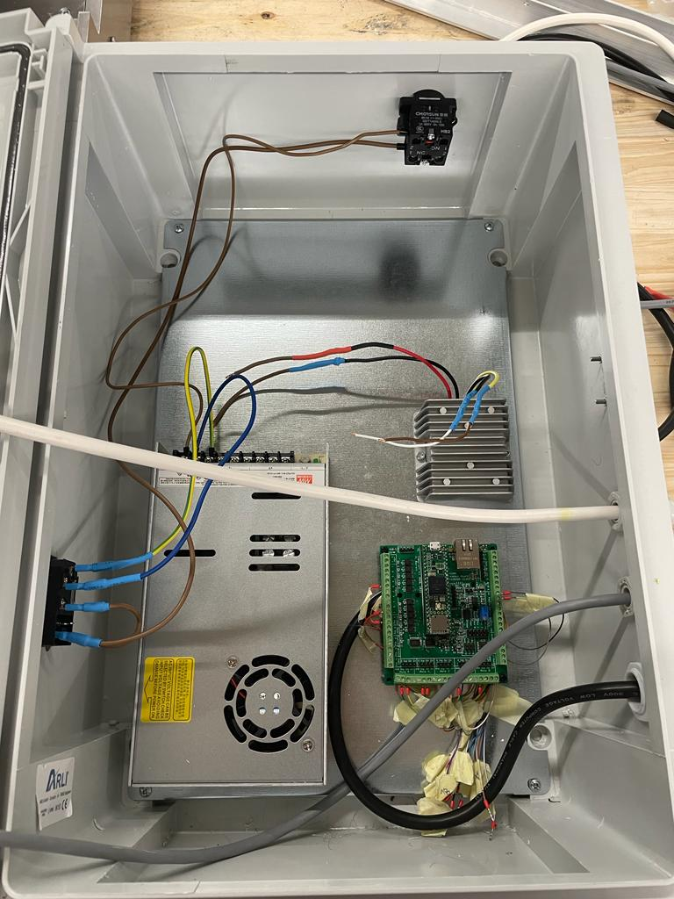

# Week 18

## CNC Milling Machine

For the latest version of a CNC milling machine being prototyped in the company, I was assigned to prepare and solder some wirings to make the electric connections. 

To begin with I first cut some wires and attached crimping connectors to them. Then, I made the connections between the DC power supply, the mains switch and the emergency stop button. Since I already had experience making these connections for the antenna system perviously, I was able to utilize what I had learned then for this present task.

Following this, I proceeded with extending the length of wirings for motor, drivers and inductive probes. I also soldered the microcontroller on the PCB that had already been prepared.

Once all connections were established, I along with my colleague inspected if all the connections made were correct and then configured the motor drivers to set it according to the requirements.

## Fabulaser Mini Kit Preparation

The next task was to prepare a kit for the assembly of the fabulaser machine in a workshop. To do this, I was provided a list of all the materials that was required to be orgranised. I started with collecting and orgranizing the fastners. 

Following this, I proceede with preparing the cables for the kit. All the necessary 2,3 or 4 core cables were cut to lengths and crimping connectors were attached. Some cables required to be soldered with inductive probes, stepper motors and window sensor.

## Fibre Laser Training

There was a training in the company which was attended by all the co-workers on how to use the new Fibre laser machine. This training covered everything, like safety measures, the basics of how to start the machine till and also taught how to use features like edge-finding. It was a really fun experience. I also got to witness a live demonstration of cuting aluminum and steel with the fibre laser.

## Adding Fastners to Antenna System

The design of the antenna system on Fusion 360 was lacking all the fastners which was used while assembling. So, after measuring the diameters and lengths of the holes on the machine in Fusion 360, I added the appropriate fastners to the entire machine.

## Reflection

 I engaged in various tasks that proved to be immensely helpful for me in relation to the CNC milling machine . As I was assigned to prepare and solder wirings for the latest version of the CNC milling machine prototype, I had the opportunity to apply my previous experience in making connections for the antenna system. This allowed me to save time and work efficiently while ensuring the electric connections were precise and secure.

 The hands-on experience of inspecting and configuring motor drivers also expanded my understanding of CNC milling machines electrical components, preparing me to handle more complex tasks in the future.

Participating in the Fibre Laser Training was a valuable opportunity to learn about advanced laser cutting technologies, safety measures, and operational procedures. Witnessing the live demonstration of cutting aluminum and steel with the fibre laser broadened my knowledge of materials processing and manufacturing techniques.

Overall, this week's experiences have not only strengthened my skills and knowledge related to the CNC milling machine but have also made me more adept at problem-solving and project management which I could apply in other projects in the future.