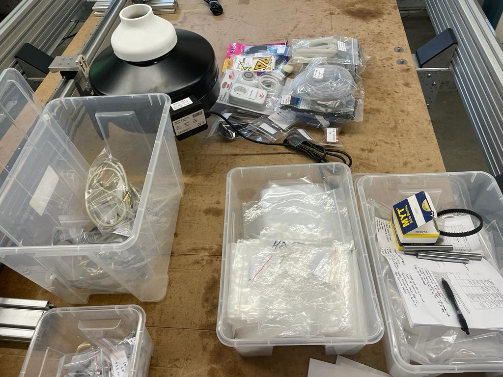
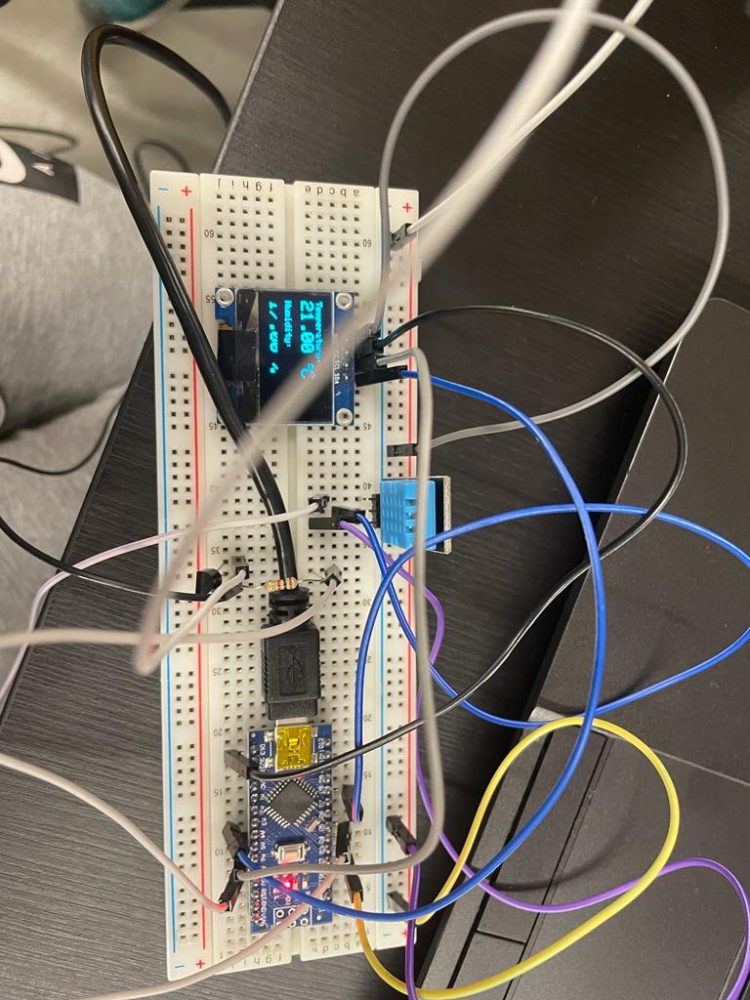

# Week 19

## Kit Preparation for Fabulaser Mini

This week, I prepared the chiller connector, cable, and emergency button for the Fabulaser kit. Following this, I was soldering wires for LED strips, to light up the machine from the inside. I also laser cut acrylic windows for the machine.

Demonstrating my organizational skills, I labeled panels and cross-referenced them with the checklist, ensuring an efficient assembly process. I organized 3D printed components, pillow blocks, and various other mechanical parts required for the kit assembly. I deburred aluminum profiles, for producing high-quality components with safety standards. Moreover, I took charge of organizing the Fabulaser kit, showcasing my ability to manage resources and meet project deadlines.

Meanwhile another kit had to be prepared and assembled to be showcased in an exhibition. I soldered and prepared cables snd the same process was repeated as the previous kit.

## Filament Dry Box

Additionally, I was assgined with a new project by starting the research and design process for a dry box for storing filament of 3d printers.For this, I first started with designing the layout of the box. After this, I researched on what components to use for the electronics and consequently started designing the schematic diagram. 

 The idea for the dry box is to use a humidity and temperature controlled regulation system to prevent moisture buildup on the filament.For this a DHT 11 sensor, OLED display, 2 12V DC fans, a BDX53C npn transistor, along with an Arduino Nano is being used.

 Upon making the first schematics, the connections were tested on a breadboard and worked fine.

 

Finally, I also learned to operate a vinyl cutter, adding a new skill to the list.

## Reflection 

The hands-on experience with CNC machinery, soldering, and component assembly honed my practical engineering skills, giving me a deeper understanding of manufacturing processes and quality control and safety standards.

Designing schematics, dry box and researching for the new project sharpened my design and innovation capabilities. The experience of organization and project management throughout the week will undoubtedly serve me well in future ,ensuring efficient resource utilization.

