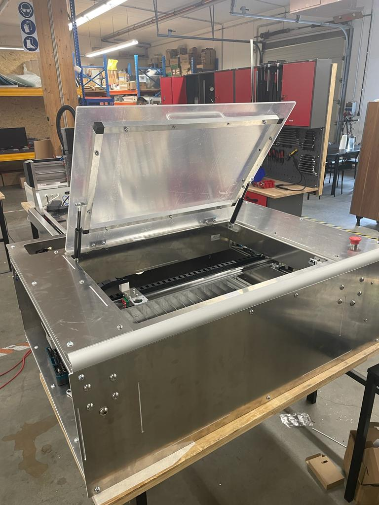
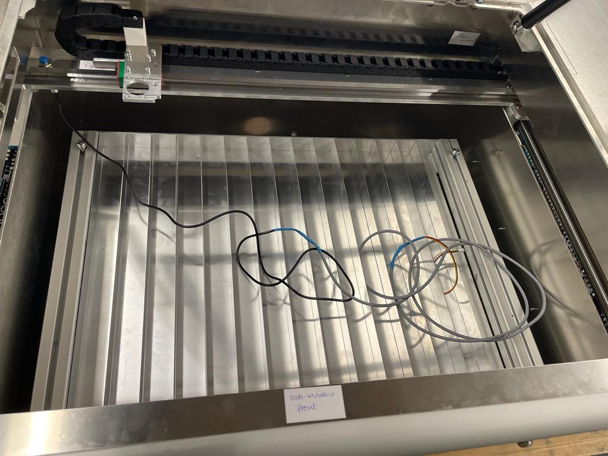
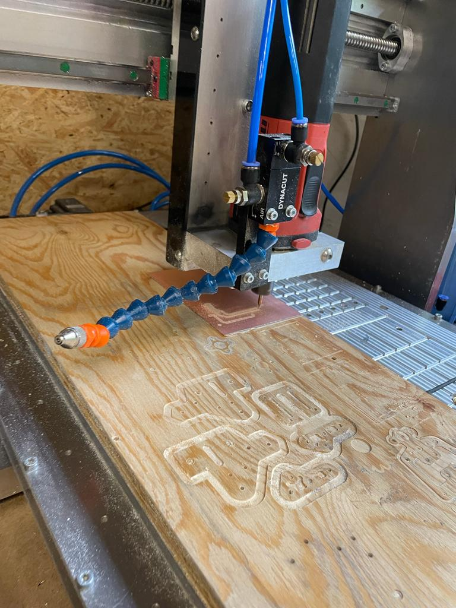
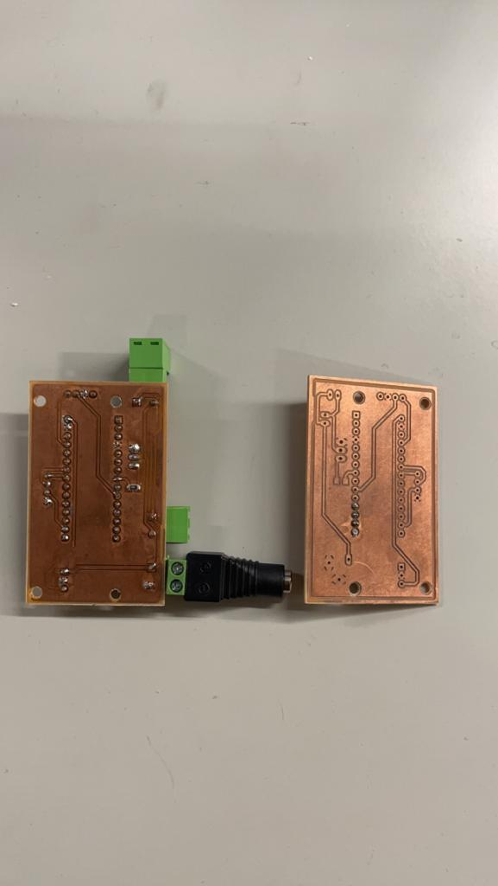
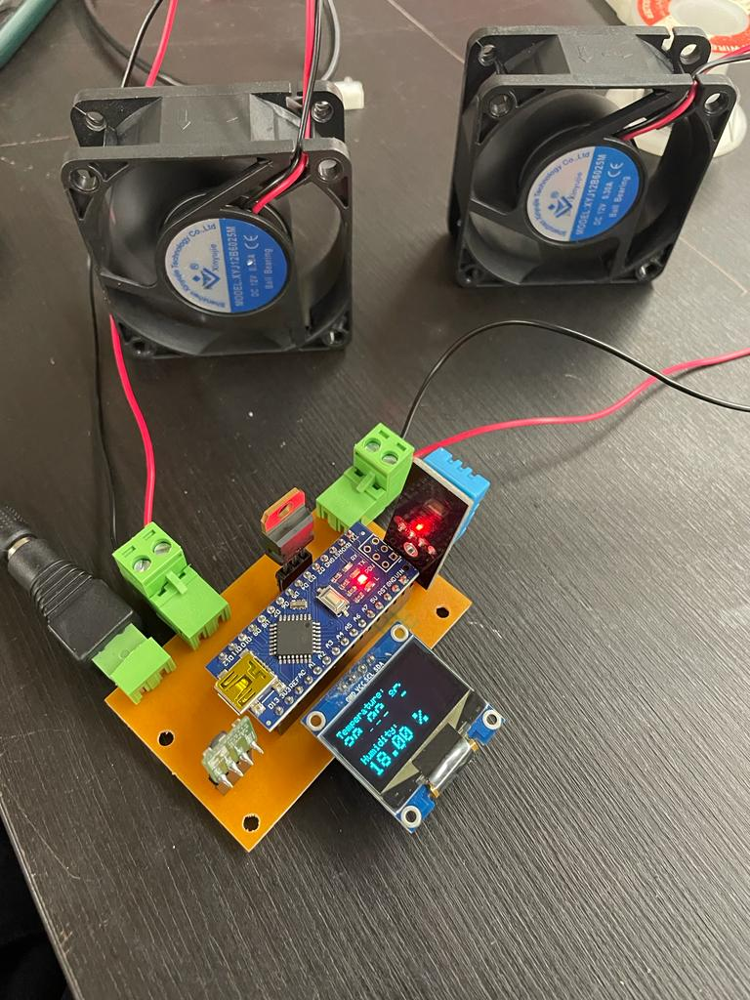
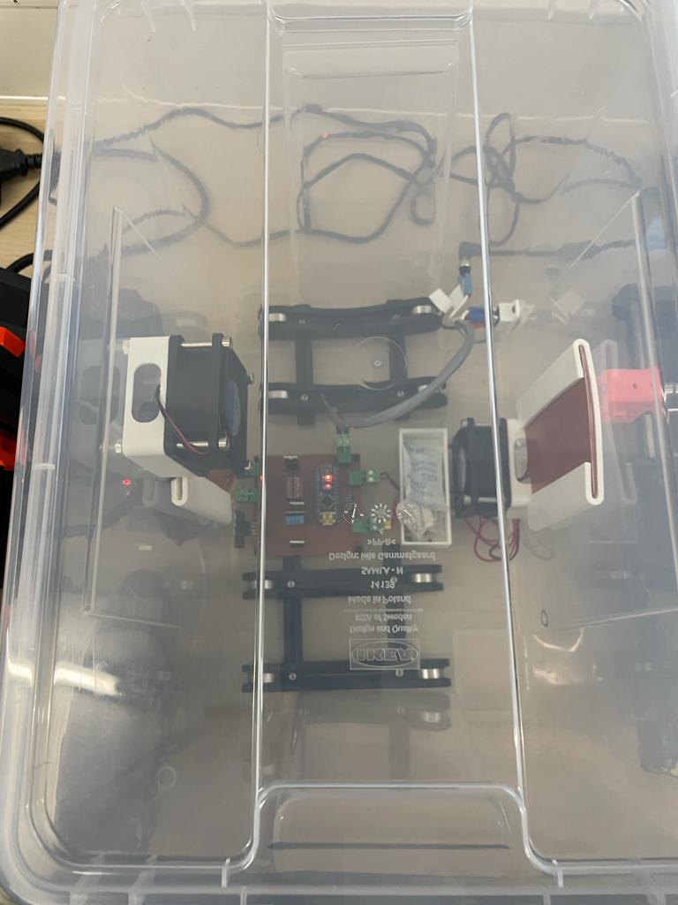

# Week 20

## Kit Preperation and Assembly

 In preparation for the Fabulaser kit, I cut aluminum profiles which will be used to support the structure of the acrylic window, to appropriate lengths and drilled holes to facilitate assembly.I also tapped panels for the Fabulaser kit, contributing to the robustness of the assembly.

In the assembly phase of the Fabulaser for the exhibition, I initiated with the assembly of the base, followed by the construction of the bed and undertook the window assembly. 

## Filament Dry Box

 I accomplished a series of significant tasks that have contributed to the advancement of our engineering projects. I made revisions from the first version of the schematic on Eagle to ensure the functioning of the pcb.Then generated a board view and planned of the circuit layout ensuring a compact board. Additionally, I diligently searched for the required components, preparing for the upcoming stages of development.

To finalize the circuit design, I made modifications to the board using EasyEDA which proved to be more flexible in terms of designing than Eagle, and with the help of FlatCAM software I was able to generate the G-code file of the pcb to mill it on the CNC Milling machine.

To successfully carry out this process, I was trained by my colleagues and learnt how to use FLATCAM and the CNC Milling machine. Subsequently, I milled the printed circuit board (PCB).

To ensure the integrity of the PCB, I thoroughly tested the connections, verifying that everything was functioning as intended. The Arduino Nano was programmed such that once the temperature reaches above 20 degrees and the humidity above 20%, the 2 fans would start running.

Continuing with the development process, I made further adjustments to both the schematic and board layout, aiming to enhance the overall design. This iterative approach ensured continuous improvement. The first version had only 2 fans, this time I added a heater as well to the output along with a transistor. These connections was again first tested on the breadboard and then another PCB was milled, adding to the progress of our project. 

Soldering all components onto the PCB was a critical step, followed by rigorous testing to confirm successful integration and functionality. While testing the PCB this time, it did not work as intended as the heater was not working. Upon trouble-shooting and looking for the error, I found out that the soldering of the connection to the heater was weak due to which a proper connection was not established and hence, the heater was not working. Later the transistor was replaced with a MOSFET for efficiency.

The final version of the PCB worked as intended and was fit into the box which would be used to store the filament.

I 3D printed a few components that would aid in holding the fans and heater in place inside the plastic box and fixed them to the box using screws. The power cable and a switch was attached to the box and the dry box was functioning as intended.

## Reflection

Through experience in designing, manufacturing, and testing PCBs, I am building a strong foundation in electronics and circuitry. The meticulous planning, editing, and iterative refinement of the schematics and layouts have improved my problem-solving skills and attention to detail.  I am cultivating technical expertise and a deeper understanding of the engineering lifecycle throughing designing and milling pcbs.
I once again had the oppurtunity to learn new softwares like FLATCAM and EasyEDA richening my skillset.

Further, the assembly process of the Fabulaser mini has exposed me to practical manufacturing challenges and how to overcome them. 

